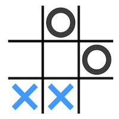
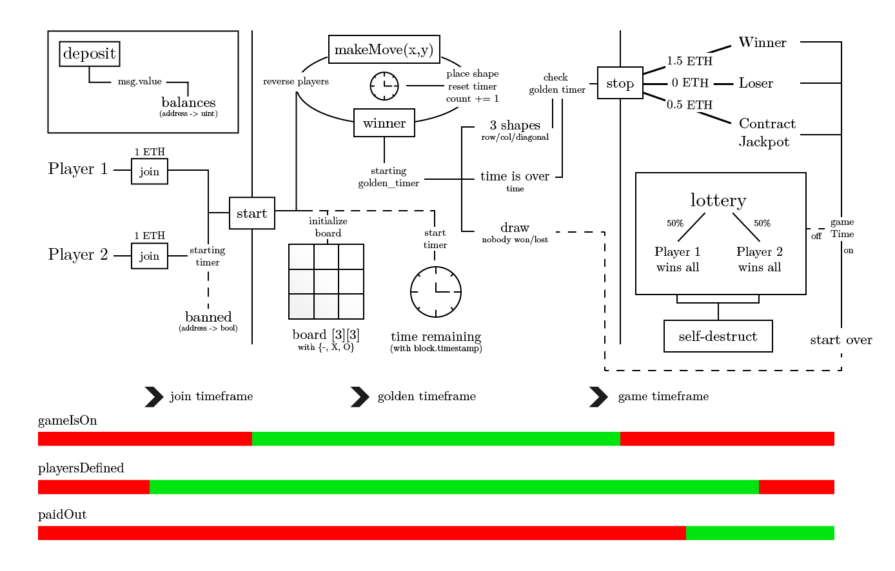

TicTacToePonzi
=======
TicTacToe Ponzi implemented in Solidity

[](https://travis-ci.org/gophish/gophish) 

[TicTacToePonzi](https://github.com/thierrygrimm/tictactoeponzi) is an open-source smart contract. It is an implementation of Tic Tac Toe in Solidity with a twist of a ponzi-similar gambling scheme. Check the rules for further details.

## Rules
### Basics for playing Tic Tac Toe




The game is played on a 3 by 3 matrix, where each player has a different shape (X|O). When taking a turn and making a move the players put their marks into an empty square until one player reaches 3 marks in a row/column/diagonal or all squares are filled. 

### Ponzi aspect and contract specific


Games are played sequentially with waiting slots for players for the next game (-1 ETH). Occupying a slot with no confirmation or intention to play results in a temporary/permanent ban. 

The contract maintains an internal balance of all deposited funds. After the game has started the players can make a move within a given time. If the time has passed, the player in turn automatically loses the game. In case of a tie all preceedings go to the contract. In case of a victory the winner gets 1.5 ETH and the loser ends up empty-handed. The margin goes to the contract. If the winnings are not redeemed within a specified time period they belong to the contract.

### Big Cash


If the last game has been less than t hours ago the game can always be **restarted**.
But if the last game was more than t hours ago a lottery starts. With a **50% chance each player can win the entire contract's jackpot (funds)** accumulated throughout the games. Finally the contract will **self-destruct**. 


## Architecture


## Setup

To excute the contract externally simply:
* **ABI**: [Download the ABI](TicTacToeABI.abi).
* **Code**: [Download the Code](TicTacToeContract.sol).


Load the code into Remix with the appropriate version ```solidity 0.5.13```. Run externally on the test network with the appropriate ABI and compiled Bytecode. Please do not load onto the main network. Any legal liability and resulting claims are denied and the user should be warned herewith.

## Start 
For visual purposes in Remix please inspect the site (Chrome) and add the following 
CSS properties to the body of remix so that the board is properly displayed: 
```
white-space: pre-wrap;
font-family: monospace;
```

## Try yourself
**Here are some basic functions**

The rules are dead-simple - just deposit some ether (at least 1 ETH) to the smart contract.
```
deposit(), Value=1 ETH
```
Now you can join the game. 
```
join()
```
Make sure to try to start the game immediately. Or else you might get banned temporairly or permanently. If no one else has joined yet you cannot get banned. But make sure to stay attentive or else the game starts without you!
```
start()
```
If you are not sure whether the game has started yet you can check.
```
gameIsOn()
```
Now that you have started check whose turn it is.
```
currentPlayer()
```
You can always draw the board.

```drawBoard()```


## Issues

Found a bug? Want more features? Find something missing in the documentation? Let us know! Please don't hesitate to [file an issue](https://github.com/thierrygrimm/tictactoeponzi/issues/new) and make a recommendation.

## License
```
tictactoeponzi - TicTacToe Smart Contract

The MIT License (MIT)

Copyright (c) 2019 Thierry Grimm

Permission is hereby granted, free of charge, to any person obtaining a copy
of this software ("TicTacToePonzi") and associated documentation files (the "Software"), to deal
in the Software without restriction, including without limitation the rights
to use, copy, modify, merge, publish, distribute, sublicense, and/or sell
copies of the Software, and to permit persons to whom the Software is
furnished to do so, subject to the following conditions:

The above copyright notice and this permission notice shall be included in
all copies or substantial portions of the Software.

THE SOFTWARE IS PROVIDED "AS IS", WITHOUT WARRANTY OF ANY KIND, EXPRESS OR
IMPLIED, INCLUDING BUT NOT LIMITED TO THE WARRANTIES OF MERCHANTABILITY,
FITNESS FOR A PARTICULAR PURPOSE AND NONINFRINGEMENT. IN NO EVENT SHALL THE
AUTHORS OR COPYRIGHT HOLDERS BE LIABLE FOR ANY CLAIM, DAMAGES OR OTHER
LIABILITY, WHETHER IN AN ACTION OF CONTRACT, TORT OR OTHERWISE, ARISING FROM,
OUT OF OR IN CONNECTION WITH THE SOFTWARE OR THE USE OR OTHER DEALINGS IN
THE SOFTWARE.
```me
